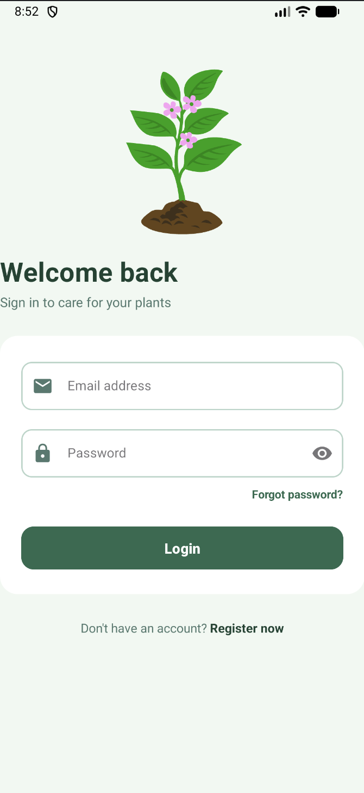
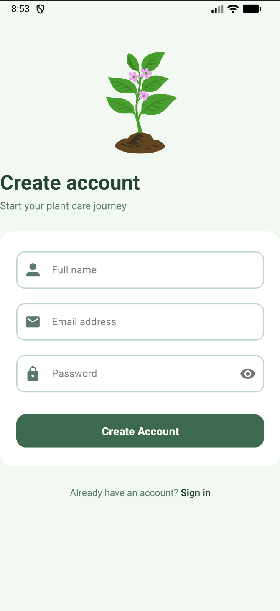
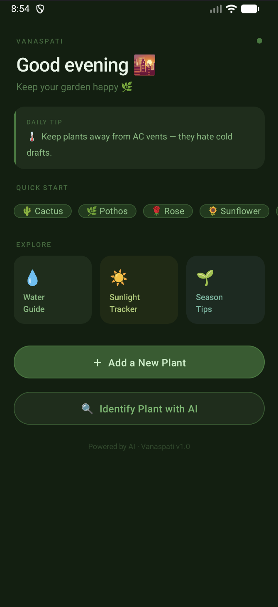
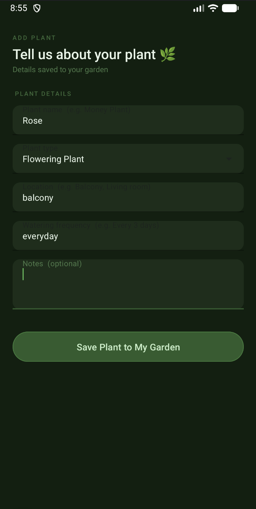
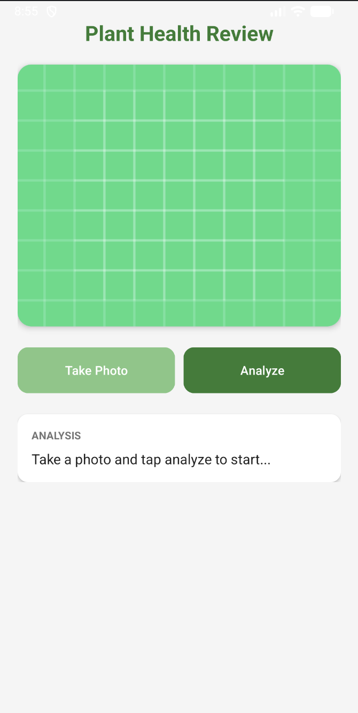
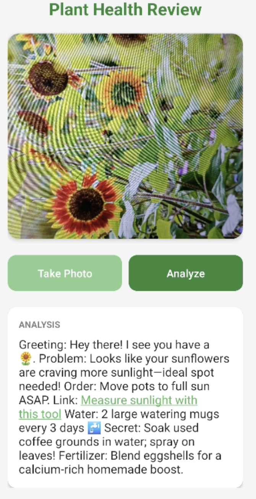

<div align="center">

<br/>

```
 ██╗   ██╗ █████╗ ███╗   ██╗ █████╗ ███████╗██████╗  █████╗ ████████╗██╗
 ██║   ██║██╔══██╗████╗  ██║██╔══██╗██╔════╝██╔══██╗██╔══██╗╚══██╔══╝██║
 ██║   ██║███████║██╔██╗ ██║███████║███████╗██████╔╝███████║   ██║   ██║
 ╚██╗ ██╔╝██╔══██║██║╚██╗██║██╔══██║╚════██║██╔═══╝ ██╔══██║   ██║   ██║
  ╚████╔╝ ██║  ██║██║ ╚████║██║  ██║███████║██║     ██║  ██║   ██║   ██║
   ╚═══╝  ╚═╝  ╚═╝╚═╝  ╚═══╝╚═╝  ╚═╝╚══════╝╚═╝     ╚═╝  ╚═╝   ╚═╝   ╚═╝
```

### 🌿 *Plant Care & AI Identification*

*"Vanaspati" — Sanskrit for "vegetation" or "plant kingdom"*

<br/>

**An AI-powered Android app that identifies plant health issues, delivers structured care advice, and maintains your personal cloud-synced plant diary — all from your smartphone camera.**

<br/>


-4CAF50?style=for-the-badge)

</div>

---

## 📖 Table of Contents

- [About](#-about)
- [App Screens](#-app-screens)
- [Features](#-features)
- [Tech Stack](#-tech-stack)
- [AI Models](#-ai-models)
- [Architecture](#-architecture)
- [How It Works](#-how-it-works)
- [Getting Started](#-getting-started)
- [Project Structure](#-project-structure)
- [Contributors](#-contributors)

---

## 🌱 About

Millions of people — from urban gardeners to small-scale farmers — struggle to identify plant diseases and get timely, affordable care advice. **Vanaspati** solves this by combining:

- 📸 **AI-powered plant diagnosis** from a photo
- 📔 **Personal cloud plant diary** synced to your account
- 🔄 **Multi-model fallback** so the AI is always available — for free

No subscription. No expert visit. Just point your camera and get a structured, friendly response in seconds.

---

## 📱 App Screens

<div align="center">

| Login | Register | Home Dashboard |
|:---:|:---:|:---:|
|  |  |  |
| *Firebase email/password sign-in* | *Account creation with validation* | *Personalised greeting, tips & quick-start chips* |

| Add Plant | AI Search | After Analysis |
|:---:|:---:|:---:|
|  |  |  |
| *Plant diary form with Firestore save* | *Camera capture + live analysis flow* | *Full 7-point AI structured response* |

</div>

---

## ✨ Features

### 🤖 AI Plant Identification
- Capture or upload a plant photo
- Receives a **7-point structured AI response**:
  1. 🌿 **Greeting** — plant identification
  2. 🔴 **Problem** — description of the issue
  3. 💊 **Doctor's Order** — quick fix recommendation
  4. 🛒 **Link** — clickable Amazon product suggestion
  5. 💧 **Water Guide** — specific quantities & schedule
  6. 👵 **Grandma's Secret** — home remedy tip
  7. 🌱 **Fertilizer Tip** — care boost advice
- Auto-retries across **5 free vision models** if one fails
- Friendly loading messages and emoji-rich output

### 📔 Personal Plant Diary
- Add plants with name, type, location, watering schedule, and notes
- Quick-add via one-tap chips: 🌵 Cactus · 🌿 Pothos · 🌹 Rose · 🌻 Sunflower
- Cloud-synced with Firestore — your garden remembered forever
- User-scoped: you only ever see your own plants

### 🔐 Authentication
- Email/password signup and login via Firebase Authentication
- Client-side validation (email format, minimum 6-char password)
- Persistent login via SharedPreferences — no re-login on relaunch
- Optimistic UI: buttons disabled during async operations to prevent double-taps

---

## 🛠 Tech Stack

| Layer | Technology | Purpose |
|---|---|---|
| Language | Kotlin | Primary development language |
| UI | Android View Binding (AndroidX) | Type-safe, null-safe view access |
| Networking | Retrofit 2 + OkHttp 4 (60s timeout) | HTTP client for OpenRouter API |
| JSON | Gson + GsonConverterFactory | Serialize/deserialize API models |
| Auth | Firebase Authentication | Secure cloud-managed user identity |
| Database | Firebase Cloud Firestore | Cloud-synced plant & user data |
| Local Storage | SharedPreferences | Persistent session & user info |
| AI Inference | OpenRouter API | Multimodal plant image analysis |
| Image | Android Bitmap API (JPEG/Base64) | Scale & encode plant photos |
| File Sharing | AndroidX FileProvider | Secure camera URI sharing |
| Build | Gradle (Kotlin DSL, AGP 8.x) | Dependency & build management |

---

## 🤖 AI Models

5 free OpenRouter vision models are loaded in a **shuffled priority list** on every session. This distributes API load and reduces rate-limit collisions:

| Priority (shuffled) | Model ID |
|:---:|---|
| 1 | `nvidia/nemotron-nano-12b-v2-vl:free` |
| 2 | `google/gemma-3-12b-it:free` |
| 3 | `google/gemma-3-27b-it:free` |
| 4 | `google/gemma-4-31b-it:free` |
| 5 | `google/gemma-4-26b-a4b-it:free` |

> **Fallback logic:** HTTP 404, 429, 502, 503 and network exceptions all trigger an automatic retry with the next model — transparent to the user. All 5 models failing shows a friendly error message.

---

## 🏗 Architecture

Vanaspati uses a clean **3-layer architecture**:

```
┌─────────────────────────────────┐
│       Presentation Layer        │
│  Native Android Activities      │
│  View Binding · Intent Extras   │
└────────────────┬────────────────┘
                 │
┌────────────────▼────────────────┐
│      Business Logic Layer       │
│  Kotlin Activities              │
│  Auth · Image Encoding          │
│  AI API calls · Firestore ops   │
└────────────────┬────────────────┘
                 │
┌────────────────▼────────────────┐
│          Cloud Layer            │
│  Firebase Auth  (identity)      │
│  Cloud Firestore  (plant data)  │
│  OpenRouter API  (AI inference) │
└─────────────────────────────────┘
```

**Key engineering decisions:**
- `FirebaseHelper` is a **Kotlin singleton object** — single `FirebaseAuth` and `Firestore` instance shared across the app lifecycle
- Both `auth` and `db` use **lazy initialisation** — created on first access, not at startup
- `analyzePlant(bitmap, modelIndex)` is a **recursive function** — clean self-contained fallback with no external retry framework
- Images are **scaled to max 1024px and compressed to 80% JPEG** before encoding, preventing OutOfMemoryErrors and reducing API latency
- Images embedded as **Base64 data URIs inline** — no separate file hosting required, app stays stateless

---

## ⚙️ How It Works

### AI Identification Flow
```
User taps "Identify Plant with AI"
        ↓
Camera permission check → Take Photo / Pick from Gallery
        ↓
scaleBitmap() → max 1024px, recycle original
        ↓
encodeImage() → 80% JPEG → Base64 NO_WRAP string
        ↓
analyzePlant(bitmap, modelIndex=0)
        ↓
OllamaRequest built → 7-point prompt + image_url data URI
        ↓
Retrofit → OpenRouter API (shuffled model)
        ↓
HTTP 404/429/502/503 or Exception?
  YES → analyzePlant(bitmap, modelIndex+1)   ← recursive fallback
  NO  → Display 7-point AI response
        ↓
All 5 models exhausted? → Friendly error message
```

### Plant Diary Flow
```
User taps "Add a New Plant" or quick-chip
        ↓
AddPlantActivity (chip pre-fills plant name)
        ↓
User fills form → taps "Save Plant to My Garden"
        ↓
savePlant() checks auth.currentUser?.uid
        ↓
hashMapOf(name, type, location, watering, notes, timestamp, userId)
        ↓
Firestore: users/{userId}/plants/.add(plant) → auto-generated ID
        ↓
"Plant saved! 🌿" Toast → finish() → back to HomeDashboard
```

---

## 🚀 Getting Started

### Prerequisites
- Android Studio Hedgehog or later
- Android device / emulator running API 28+
- Firebase project with Authentication and Firestore enabled
- OpenRouter API key (free tier)

### Setup

**1. Clone the repository**
```bash
git clone https://github.com/VAANI-GOEL/Vanaspati.git
cd Vanaspati
```

**2. Connect Firebase**
- Go to [Firebase Console](https://console.firebase.google.com/)
- Create a new project and add an Android app (`com.vaanigoel.vanaspati`)
- Download `google-services.json` and place it in the `/app` directory
- Enable **Email/Password Authentication** and **Cloud Firestore**

**3. Add your OpenRouter API key**
- Sign up at [openrouter.ai](https://openrouter.ai) (free)
- Add your key to `RetrofitClient.kt` in the Authorization header

**4. Build and run**
```bash
./gradlew assembleDebug
```

---

## 📁 Project Structure

```
app/src/main/
├── java/com/vaanigoel/vanaspati/
│   ├── LoginActivity.kt              # Firebase sign-in
│   ├── SignupActivity.kt             # Account creation + Firestore profile
│   ├── HomeDashboard.kt              # Main screen, CTA buttons, quick chips
│   ├── AddPlantActivity.kt           # Plant diary form + Firestore write
│   ├── ReviewProgressActivity.kt     # Camera capture + AI pipeline
│   ├── utils/
│   │   ├── FirebaseHelper.kt         # Singleton Firebase Auth + Firestore
│   │   ├── RetrofitClient.kt         # OkHttp + Retrofit singleton
│   │   └── UserPreferences.kt        # SharedPreferences session storage
│   └── models/
│       └── OllamaModels.kt           # API request/response data classes
├── res/
│   ├── layout/                       # XML layouts for each Activity
│   └── xml/
│       └── file_paths.xml            # FileProvider path config
└── AndroidManifest.xml               # Permissions + FileProvider declaration
```

---

## 👩‍💻 Contributors

<div align="center">

| | Name | Role |
|:---:|---|---|
| 🌿 | **Vaani Goel** | Co-developer · Android + Firebase + UI/Ux + AI integration |
| 🌿 | **Vaani Gupta** | Co-developer · Android + Firebase + UI/Ux + AI integration |

*Both are first-year B.Tech CSE students at **IGDTUW, Delhi***

*"Built as a practical exploration of Generative AI, multi-model orchestration, and Android development."*

</div>

---

<div align="center">

Made with 🌿 and Kotlin &nbsp;·&nbsp; **Vanaspati v1.0**

*Powered by AI · For every gardener, everywhere*

</div>
